# Analog to digital converter

## 1. จากโลกฟิสิกส์สู่โลกดิจิทัล

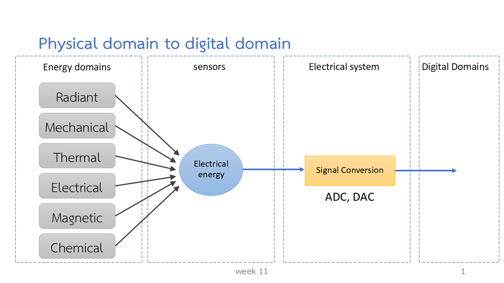

### 1.1 พลังงานจากโลกจริง (Physical Energy Domains)

โลกจริงเต็มไปด้วยพลังงานหลายรูปแบบ เช่น
- ☀️ รังสี (Radiant) เช่น แสงจากดวงอาทิตย์
- ⚙️ กลไก (Mechanical) เช่น การเคลื่อนไหวหรือแรงกด
- 🔥 ความร้อน (Thermal) เช่น อุณหภูมิร่างกาย
- ⚡ ไฟฟ้า (Electrical) เช่น แรงดันไฟฟ้าจากแบตเตอรี่ 
- 🧲 แม่เหล็ก (Magnetic) เช่น พลังงานแม่เหล็กโลก
- 🧪 เคมี (Chemical) เช่น กลิ่นจากสารระเหยต่าง ๆ 

พลังงานเหล่านี้คือสิ่งที่เราต้องการ "วัด" หรือ "ตรวจจับ" เพื่อให้ไมโครคอนโทรลเลอร์สามารถรับรู้สิ่งแวดล้อมได้

### 1.2 เซนเซอร์ (Sensors)

เซนเซอร์ทำหน้าที่เป็นผู้แปลภาษาโลกจริงให้กลายเป็นสัญญาณไฟฟ้า เช่น:
- Thermocouple แปลงความร้อนเป็นแรงดันไฟฟ้า
- Photodiode แปลงแสงเป็นกระแสไฟฟ้า
- Load cell แปลงแรงกดเป็นสัญญาณไฟฟ้า

เซนเซอร์คือ "ประตู" ที่เชื่อมโลกฟิสิกส์กับระบบอิเล็กทรอนิกส์

### 1.3 ระบบไฟฟ้าและการแปลงสัญญาณ (Signal Conversion)

เมื่อได้สัญญาณไฟฟ้าแล้ว 

- เราต้องการการแปลงสัญญาณแอนะล็อกเป็นดิจิทัล 
- เป็นหน้าที่ของ ADC (Analog-to-Digital Converter): 

### 1.4 โลกดิจิทัล (Digital Domain)
เมื่อสัญญาณถูกแปลงเป็นดิจิทัลแล้ว
- ไมโครคอนโทรลเลอร์สามารถประมวลผลด้วยโค้ด
- โลกดิจิทัลคือพื้นที่ที่นักศึกษาจะได้ "เขียนโค้ด" เพื่ออธิบายสิ่งต่าง ๆ ที่เกิดขึนในโลกจริง จากข้อมูลที่รับเข้ามา

## 2. ตัวอย่างสัญญาณในรูปแบบต่าง ๆ

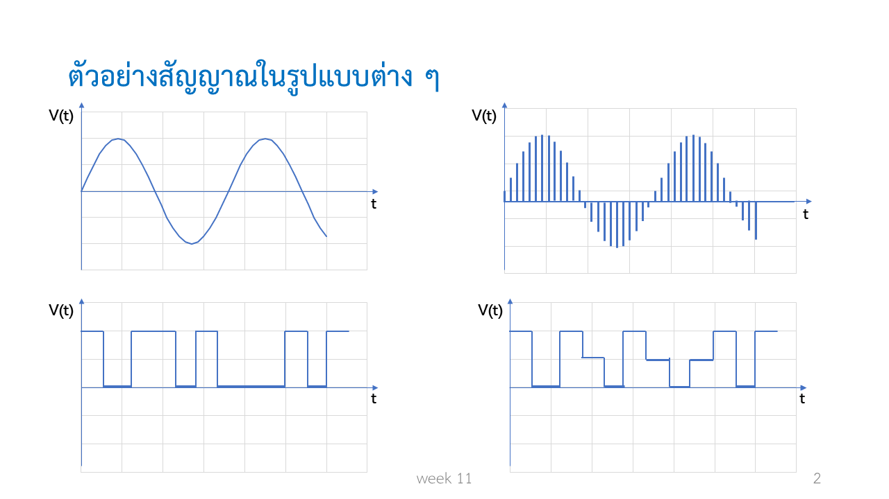

ภาพประกอบด้วยกราฟ V(t) เทียบกับเวลา (t)  ซึ่งสามารถอธิบายได้ดังนี้

### 2.1 สัญญาณไซน์ (Top-left)
- สัญญาณไซน์มักจะคลื่นต่อเนื่อง มีความถี่และแอมพลิจูดตามลักษณะเฉพาะของแหล่งกำเนิด
- ในโลกจริง สัญญาณจะมีการเปลี่ยนแปลงตามเวลา และมีลักษณะที่ต่อเนื่อง จนยากจะบอกระดับของการเปลียนแปลงได้
- ตัวอย่าง: สัญญาณเสียง, สัญญาณไฟฟ้าจากเซนเซอร์วัดการสั่น

### 2.2 สัญญาณที่ผ่านการสุ่ม (Top-right)
- ในโลกดิจิทัล เราไม่สามารถสัญญาณทั้งหมดมาประมวลผล 

### 2.3 สัญญาณพัลซ์ (Bottom-left)
- ไมโครคอนโทรลเลอร์ ทำงานด้วยระดับสัญญาณคงที่ จะไม่เข้าใจสัญญาณที่มีลักษณะดังภาพด้านบน  
- สัญญาณภายในในไมโครคอนโทรลเลอร์จะมีแรงดันคงที่ เพียง 2 ระดับ อธิบายด้วยระดับลอจิก 0 และ ลอจิก 1 
- สิ่งที่แสดงความแตกต่างจึงปรากฏในลักษณะความถี่หรือความากว้างของสัญญาณ

### 2.4 สัญญาณดิจิทัลไม่สม่ำเสมอ (Bottom-right)
• 	สัญญาณที่สื่อสารในระบบ อาจมีระดับสูง-ต่ำแบบไม่เป็นระเบียบ ช่วยให้แทนข้อมูลได้มากขึ้น และไมโครคอนโทรลเลอร์เข้าใจได้ไม่ยาก

## 3. การตีความสัญญาณดิจิทัล (ลอจิก 1) ของ ESP32

## 4. การตีความสัญญาณดิจิทัล (ลอจิก 0) ของ ESP32

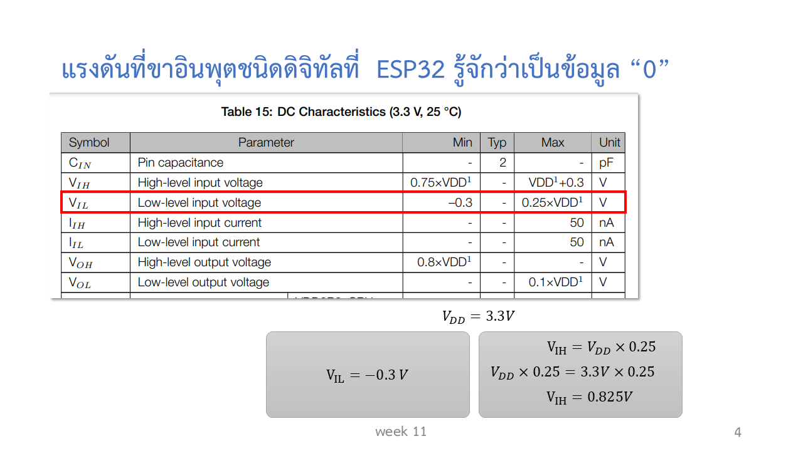

## 5. แรงดันที่ขาอินพุตชนิดดิจิทัลที่ไอซีดิจิทัลทั่วไปรู้จัก (ระบบแรงดัน 5 V)

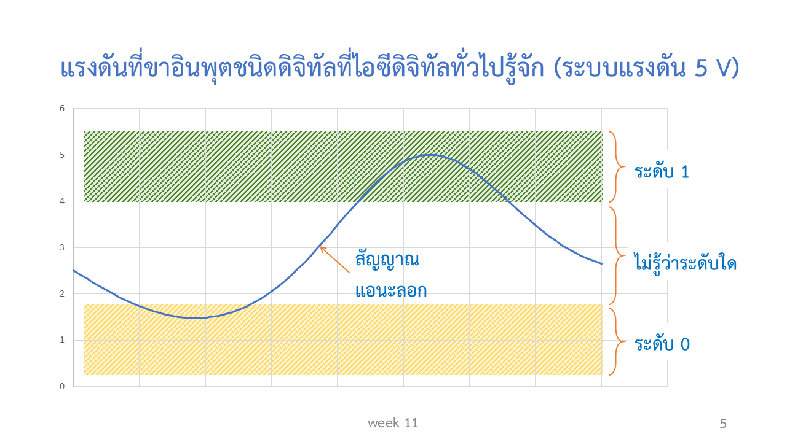

## 6. แนวคิดในการแปลงสัญญาณ A/D 

 <!-- 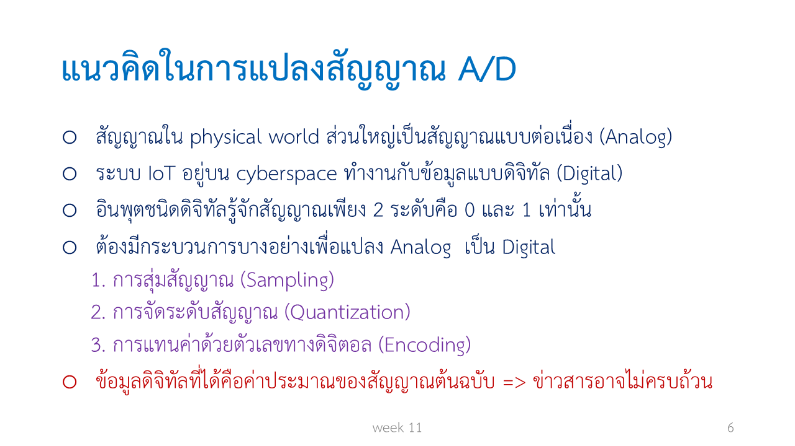 -->

- สัญญาณใน physical world ส่วนใหญ่เป็นสัญญาณแบบต่อเนื่อง (Analog)  
  ระบบ IoT อยู่บน cyberspace ทำงานกับข้อมูลแบบดิจิทัล (Digital)
- อินพุตชนิดดิจิทัลรู้จักสัญญาณเพียง 2 ระดับคือ 0 และ 1 เท่านั้น
- ต้องมีกระบวนการบางอย่างเพื่อแปลง Analog  เป็น Digital
1. การสุ่มสัญญาณ (Sampling)
2. การจัดระดับสัญญาณ (Quantization)
3. การแทนค่าด้วยตัวเลขทางดิจิตอล (Encoding)
- ข้อมูลดิจิทัลที่ได้คือค่าประมาณของสัญญาณต้นฉบับ => ข่าวสารอาจไม่ครบถ้วน

### 6.1 การสุ่มสัญญาณ (Sampling) 

- การสุ่มสัญญาณคือการดึงตัวอย่างของสัญญาณแอนะลอกในเวลาที่ต้องการ (ที่มีคาบสม่ำเสมอ)
- ในทางทฤษฎีทำได้โดยการคูณสัญญาณ input เข้ากับสัญญาณ impulse ที่มีคาบคงที่
- สัญญาณ impulse คือสัญญาณพัลส์ที่มีความกว้างของพัลส์เป็นศูนย์
- สัญญาณ output ที่ได้เรียกว่าสัญญาณ analog แบบ discrete

#### 6.1.1 การสุ่มสัญญาณในทางปฏิบัติ

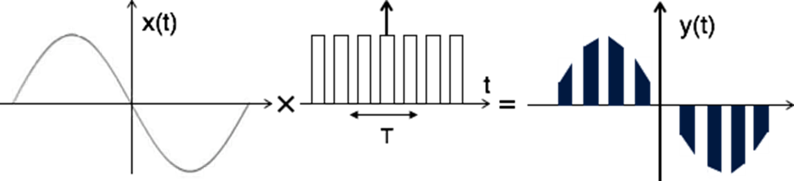

ในทางปฏิบัติ เราไม่สามารถสร้างพัลส์ที่มีความกว้างเป็นศูนย์

สัญญาณพัลส์ที่นำมาดึงตัวอย่างจะได้มีลักษณะกว้างและให้เอาต์พุตดังรูป

<!-- 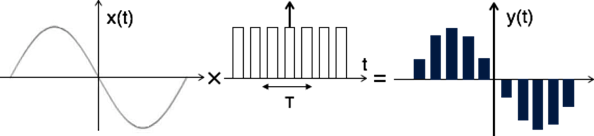 -->

ในการแปลงสัญญาณ analog to digital เราต้องการยอดสัญญาณที่คงที่ (flat) 

ใช้หลักการรักษาระดับให้คงที่โดยวงจรอิเล็กทรอนิกส์

เรียกว่า วงจร sample and hold (S/H)

#### การสุ่มสัญญาณ (Sampling) 

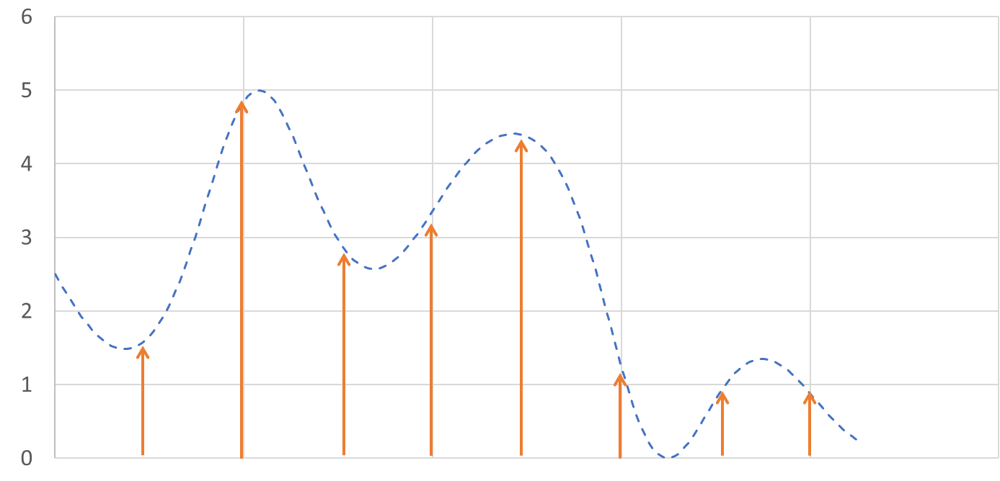

#### การสุ่มและคงค่าสัญญาณ (Sampling and hold) 

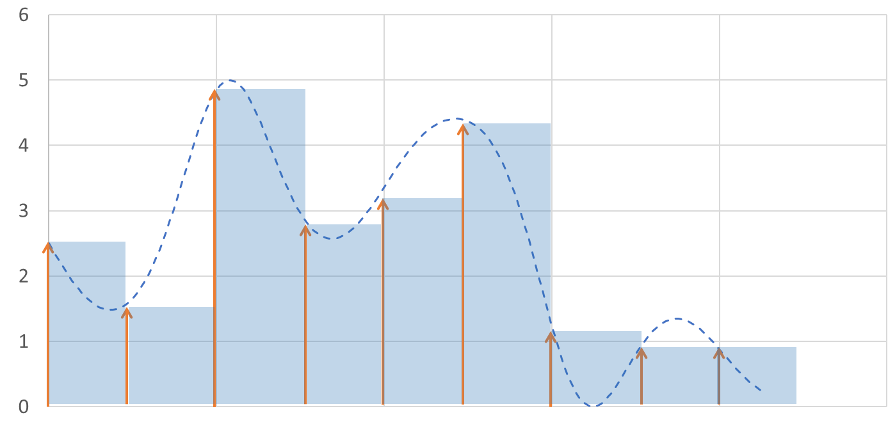

## 6.2 การจัดระดับสัญญาณ (Quantization) 
<!-- 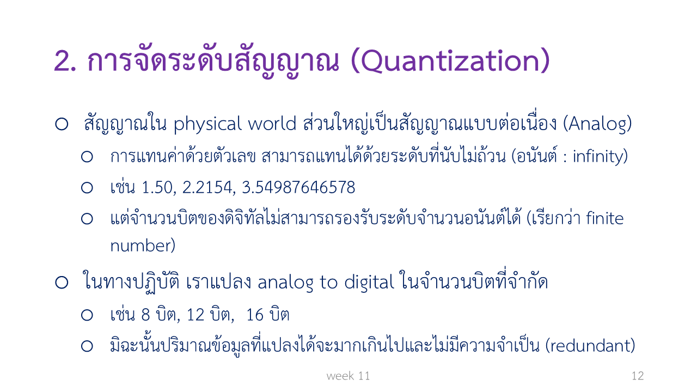 -->

- สัญญาณใน physical world ส่วนใหญ่เป็นสัญญาณแบบต่อเนื่อง (Analog)

 การแทนค่าด้วยตัวเลข สามารถแทนได้ด้วยระดับที่นับไม่ถ้วน (อนันต์ : infinity)

เช่น 1.50, 2.2154, 3.54987646578  

แต่จำนวนบิตของดิจิทัลไม่สามารถรองรับระดับจำนวนอนันต์ได้ (เรียกว่า finite number) 

- ในทางปฏิบัติ เราแปลง analog to digital ในจำนวนบิตที่จำกัด

เช่น 8 บิต, 12 บิต,  16 บิต

มิฉะนั้นปริมาณข้อมูลที่แปลงได้จะมากเกินไปและไม่มีความจำเป็น (redundant)  

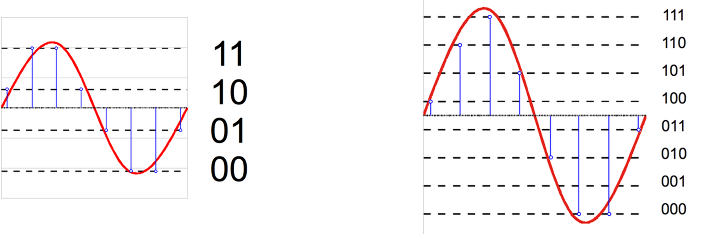

ในงานแต่ละอย่างจะต้องการความละเอียดของข้อมูลที่แตกต่างกันไป

จำนวนระดับในการแปลงจะเป็นตัวกำหนดจำนวนบิตข้อมูล

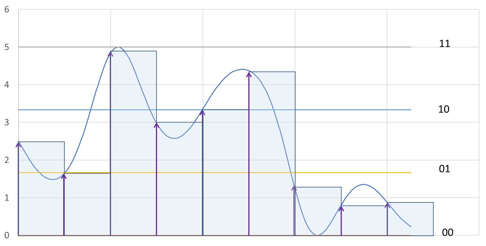

สัญญาณที่ได้จากการสุ่มและจัดระดับ ไม่ได้ตรงกับค่าทางดิจิทัลที่ต้องการเสมอไป

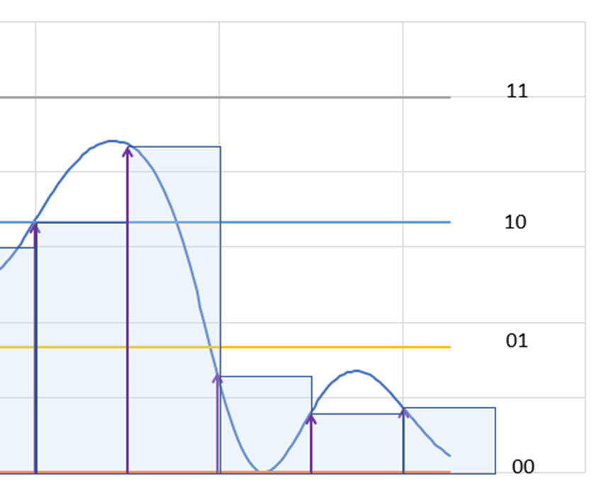

## 6.3 การแทนค่าด้วยตัวเลขทางดิจิตอล (Encoding)

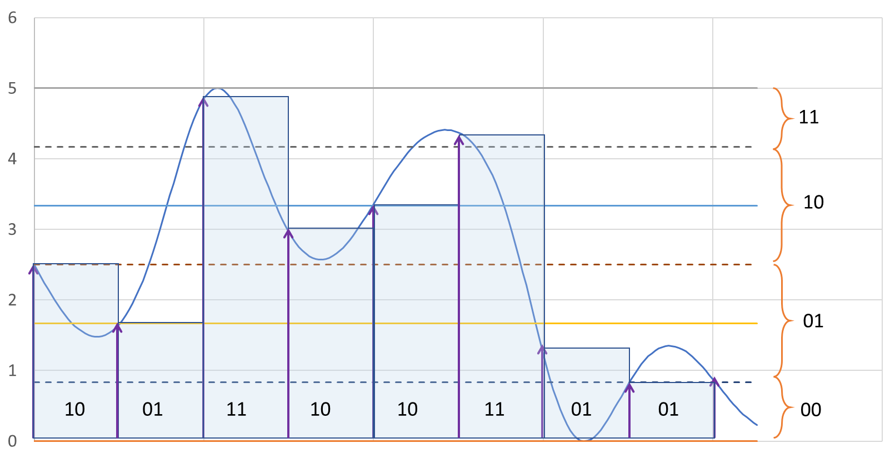

### 6.3.1  Quantization error

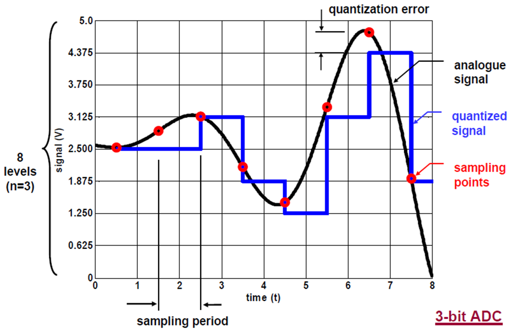

## 6.4 พารามิเตอร์ที่สำคัญของ ADC

#### จำนวนบิต

จำนวนบิตมากจะทำให้แทนค่าสัญญาณแอนะลอกได้ละเอียด  

#### Quantization error 

 ค่าแตกต่างระหว่างค่าแอนะลอกกับระดับการควอนไตซ์ 

#### Sample time

ช่วงเวลาที่ตัวเก็บประจุต้องเก็บแรงดันอินพุต

#### Conversion time 

เวลาที่ใช้ในการแปลงแรงดันที่เก็บในตัวเก็บประจุไปเป็นค่าทางดิจิตอล

## 6.5 ตัวอย่าง A/D Converters ประเภทต่าง ๆ 

### 6.5.1 Flash ADC (1 บิต) 

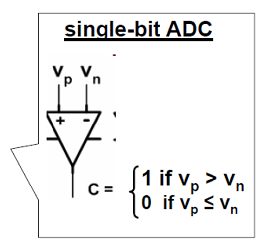

ข้อดี: เป็น ADC ที่ทำงานเร็วที่สุด

ข้อเสีย: ความละเอียดจำกัด, ราคาแพง, กินกำลังงานมาก 

### 6.5.2  Flash ADC (3 บิต)

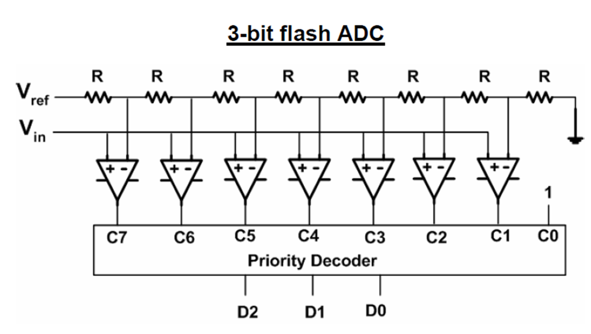

#### successive-approximation ADC

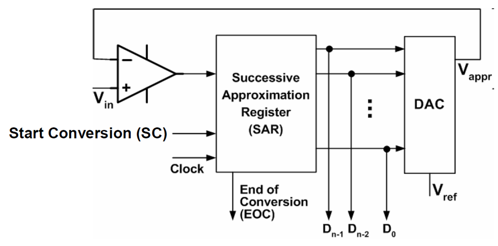

##### หลักการทำงาน
- ใช้ DAC สร้างแรงดันเลียนแบบแรงดันอินพุต
- ใช้ comparator เปรียบเทียบความแตกต่างระหว่าง Vin และ Vappr
- เริ่มทำงานโดยให้  SC = 1 เมื่อแปลงเสร็จ จะได้ EOC = 1 
##### ลักษณะเฉพาะ
- ความเร็วสูง
- นิยมใช้กันมาก 

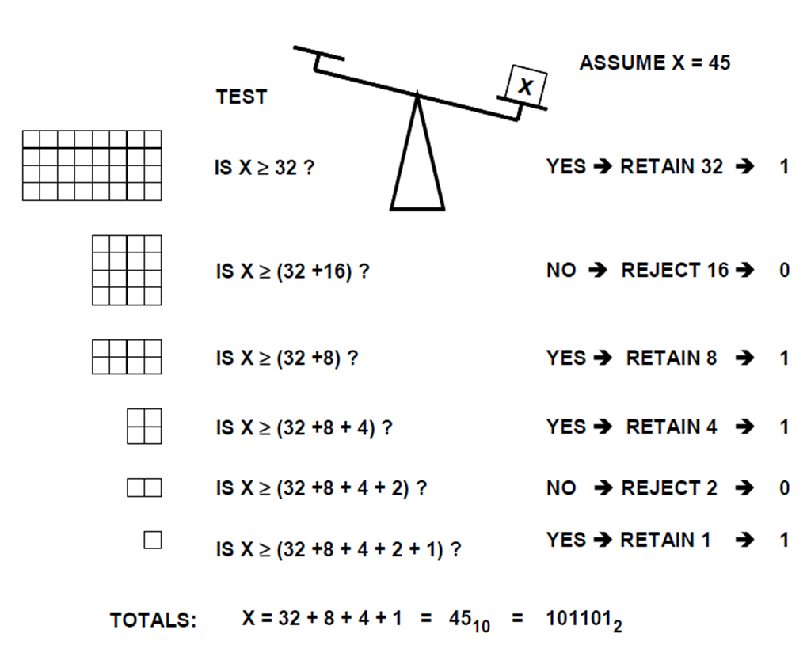

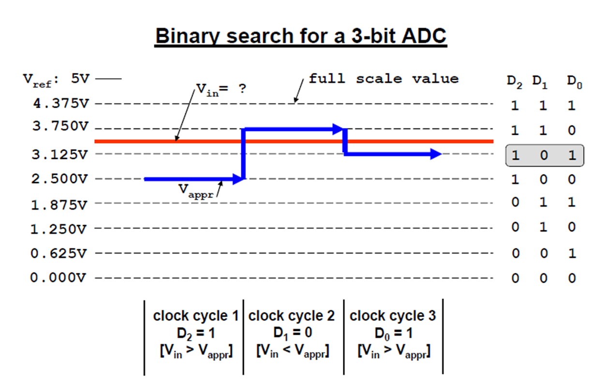

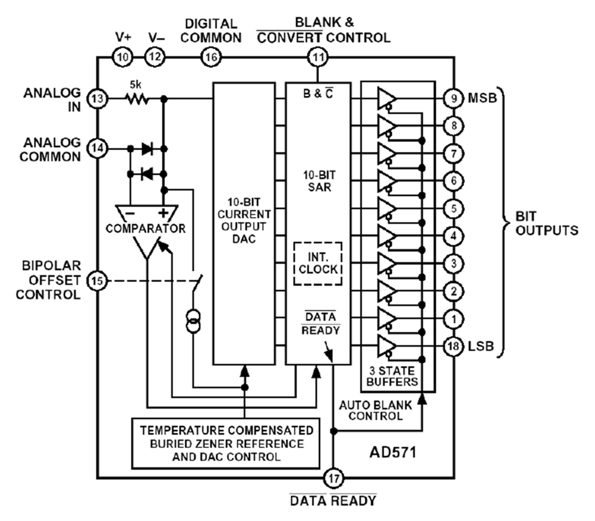

### 6.5.3 Dual Slope Integrating A/D ADC

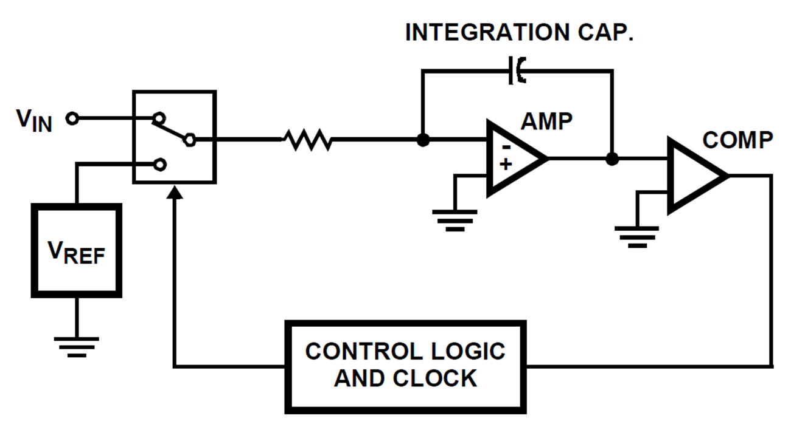

### การทำงานของวงจรแปลง ADC แบบ  Dual Slope Integrating

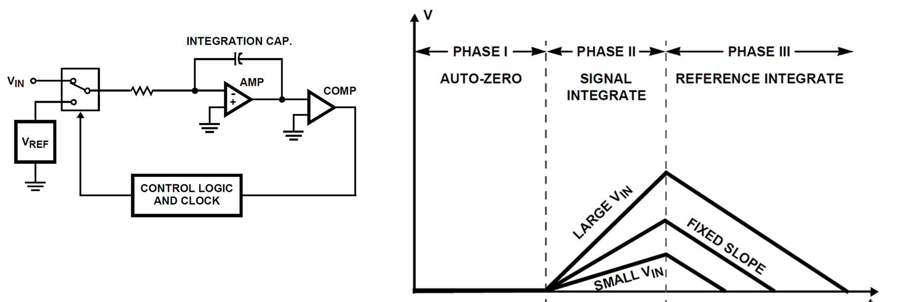

#### Phase 1, Auto-Zero. 

ในช่วงนี้ แรงดันตกค้างใน วงจรแอนะลอกส่วนต่างๆ จะถูกล้างออกจนหมด โดยการต่ออินพุตลงกราวด์ และลัดวงจรตัวเก็บประจุในส่วนป้อนกลับ 

#### Phase 2, Signal Integrate

สัญญาณอินพุตจะถูกนำมาเก็บในวงจร  integrated  ด้วยจำนวนคล็อกที่คงที่ 

ADC ขนาด 3 หลักครึ่ง นับ 1,000 pulses  

ADC ขนาด  4 หลักครึ่ง นับ 10,000 pulses

เมื่อครบจำนวนพัลส์ แรงดัน V จะมีสัดส่วนแปรผันโดยตรงกับแรงดัน Vin

#### Phase 3, Reference Integrate. 

ตอนเริ่มเฟสนี้  อินพุตของวงจร integrator จะสวิตช์จาก  VIN ไปยัง VREF 

จากนั้น counter จะนับ pulse ในช่วงการคายประจุของ C ในวงจร  integrator จนหมด 

ค่าที่ได้จากการนับ ถือเป็นค่าทางดิจิตอลของสัญญาณอินพุต VIN

### ตัวอย่าง ADC แบบ dual slope

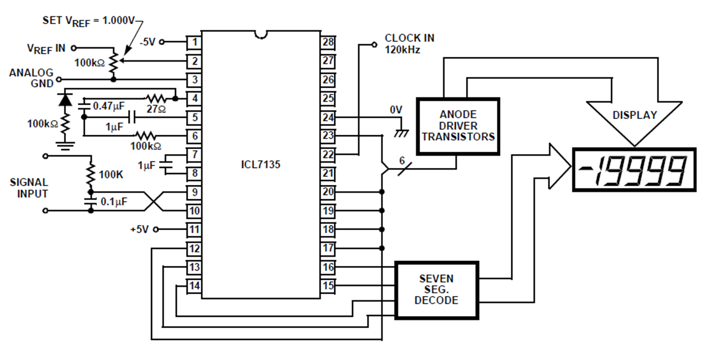
